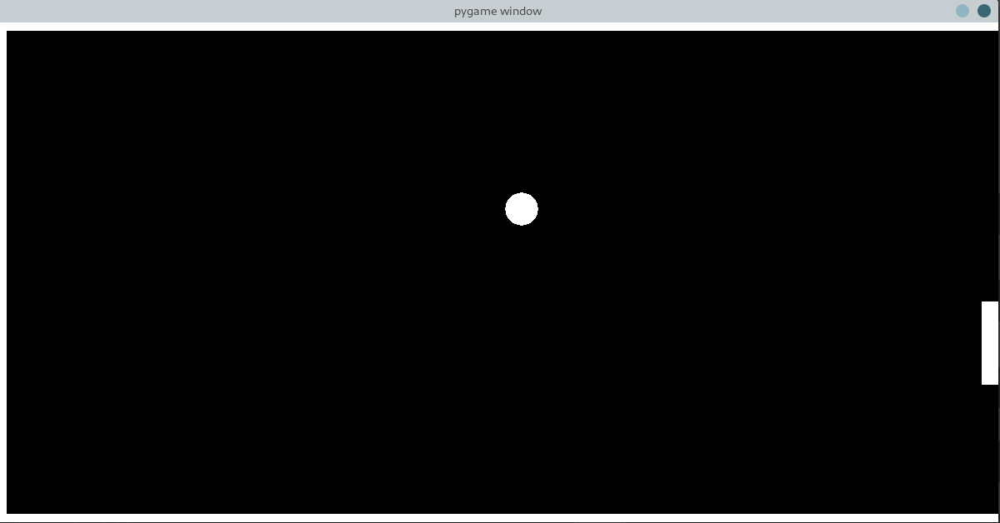

## Pong Game with AI
<br />
<p align="center">

<br />
<br />


<br />


<!-- :) -->


### Installing


* Clone the repository:

```sh
git clone https://github.com/emrekndl/pongwithAI.git
```

* CD in to the directory:

```sh
cd pongwithAI
```

* Install dependencies:

```sh
pip install -r requirements.txt
```

* Tek oyunculu oynama
```sh
python3 pong.py
```
* AI ile birlikte oynama
```sh
python3 pongAI.py
```
* Veri Kümesi oluşturma
```sh
python3 dataSetCreate.py
```
* Modelleri eğitme
```sh
python3 pongAiTrain.py.py
```
* Modelleri test etme
```sh
python3 pongAiTest.py
```
<br />

> **Kullanılan Modeller**
- [KNN](https://scikit-learn.org/stable/modules/generated/sklearn.neighbors.KNeighborsRegressor.html#sklearn.neighbors.KNeighborsRegressor)
- [SVM](https://scikit-learn.org/stable/modules/generated/sklearn.svm.SVR.html)
- [Random Forest](https://scikit-learn.org/stable/modules/generated/sklearn.ensemble.RandomForestRegressor.html)
- [Linear Regression](https://scikit-learn.org/stable/modules/generated/sklearn.linear_model.LinearRegression.html)
- [Logistic Regression](https://scikit-learn.org/stable/modules/generated/sklearn.linear_model.LogisticRegression.html)
- [Decision Tree Regressor](https://scikit-learn.org/stable/modules/generated/sklearn.tree.DecisionTreeRegressor.html)
- [Naive Bayes](https://scikit-learn.org/stable/modules/generated/sklearn.naive_bayes.GaussianNB.html)

[](http://hits.dwyl.com/emrekndl/opencvPython)
